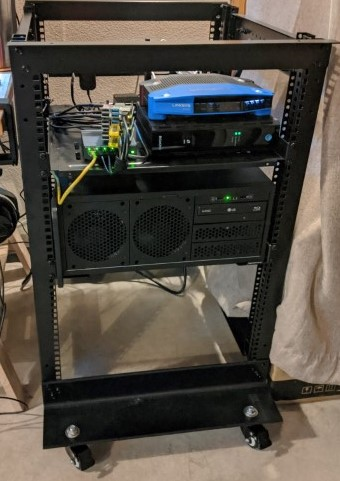
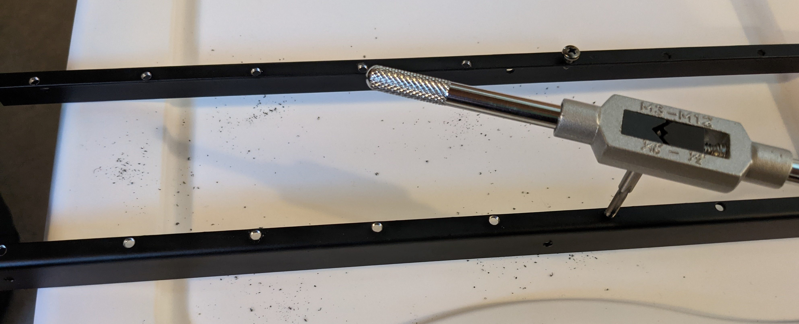
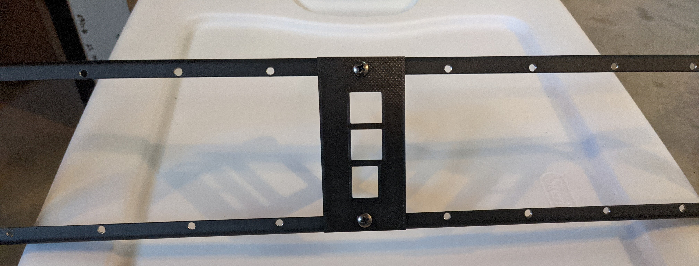
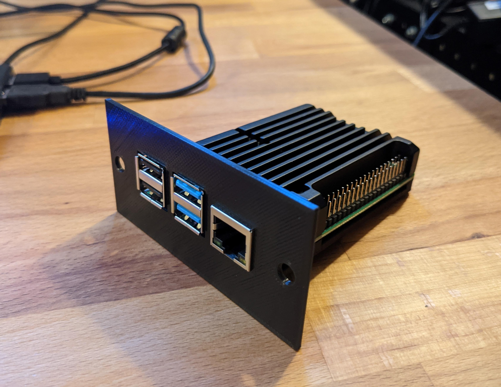
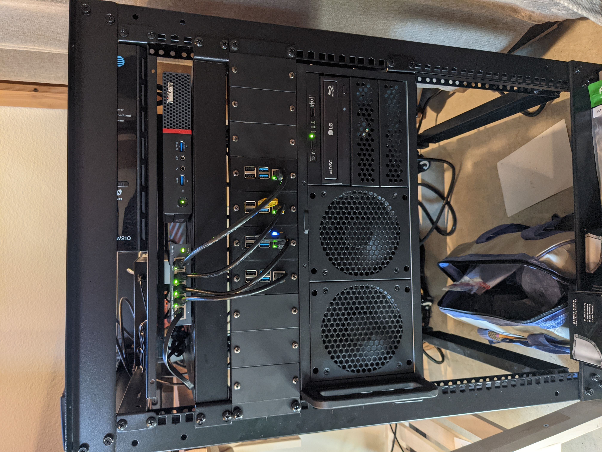

My stack of Raspberry PIs was getting a little tippy... A bracket from Germany and some 3D printing later and it's good to go.

<!--more-->

_There are affiliate links below that I may earn a commission from._

## Previously
My Raspberry PIs had been just sitting on a shelf in the server rack. They were mounted together, but the stack of them would often slide around on the shelf. The stack can be seen below sitting on top of the switch. Getting the ethernet cables to cooperate in this orientation was not pretty.

As mentioned in [server rack update](), I bought a [bracket](https://www.musicstore.de/de_DE/EUR/DAP-2-HE-Rackblende-f-Modulsystem-10-Segmente-MP-1/art-PAH0017160-000;pgid=WBtg67.syLdSRpoV6L_EAtys0000YDPT2oVh) from a random german store. Well it finally arrived, but then I had to actually get the mounts to put in.

## Mounting the PIs
I had the `.stl` from [here](https://www.kaibader.de/3d-printed-raspberry-pi-rack-mount-with-heat-sink-passive-cooling/) printed using [makexyz.com](https://www.makexyz.com/). It was pretty convenient and arrived in like a week. The actual quality of the print wasn't the greatest with some significant artifacts on the face.

After lining it up to the rack, I realized it was also too tall to align with the screw holes. On top of that, it seemed the holes in the bracket weren't actually tapped, so the included screws didn't fit.

I ended up buying a [taps set](https://www.amazon.com/gp/product/B07WN8BGWJ?tag=kasuboski-20&geniuslink=true). That tap was able to thread the holes for M4. It was easy enough, but took some time.

The next issue was the actual mount was too big. Only one screw was able to be attached. I ended up buying a 3D printer instead of using a service. I got the [Creality CR6-SE](https://www.amazon.com/gp/product/B08GLH4WFG?tag=kasuboski-20&geniuslink=true). Now able to print my own parts, I bought a [digital caliper](https://www.amazon.com/gp/product/B07DFFYCXS?tag=kasuboski-20&geniuslink=true) and modified the mount in [FreeCAD](https://www.freecadweb.org/) to match the dimensions. After 2 iterations, I ended up with a good fit.

I attached the Raspberry PIs to the mount using the top part of this [heatsink case](https://www.amazon.com/gp/product/B085XPHY77?tag=kasuboski-20&geniuslink=true). The screws that came with easily fit through the 3D printed part. I did notice a few degree difference with and without the heatsink so it's not just to look good 😉.

With all of that done, I now have all of the Raspberry PIs mounted. I bought a [full length shelf](https://www.amazon.com/gp/product/B00LT6432U?tag=kasuboski-20&geniuslink=true) that holds the switch for the pis and a thinkcentre pc. My entire rack is able to be pulled out from the wall now without worrying about something toppling.

